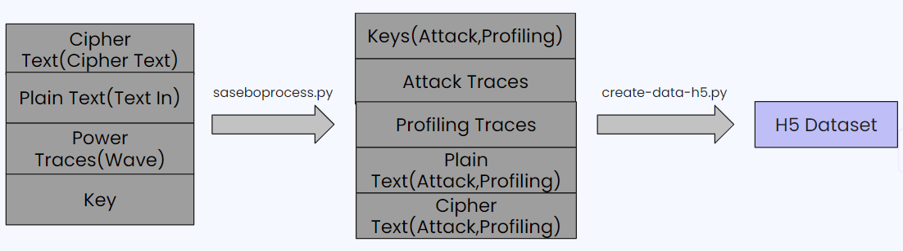

## Table of Contents
+ [Side Channel Attacks](#side_channel_attacks)
+ [Power Analysis Attacks](#power_analysis_attacks)
+ [Countermeasures](#countermeasures)
+ [Runtime Frequency Tuning Countermeasure](#RFTC)
+ [AISY Framework](#AISY)
+ [Power Traces](#power_traces)
+ [Create H5 dataset](#create_h5)

___

## Side Channel Attacks 
A side-channel attack is a type of security vulnerability or attack that targets a computer system or cryptographic algorithm by exploiting unintended information leakage from various channels, such as power consumption, electromagnetic radiation, timing, or even sound. These attacks do not typically target the core algorithm or the encryption keys directly but instead focus on the observable side-effects of a system's operation. By analyzing these side-channel information leaks, attackers can potentially deduce sensitive information like encryption keys or data. Side-channel attacks can be a significant threat to the security of systems and are a critical consideration in the design and evaluation of secure hardware and software implementations. 
Eg;
+ Power Analysis Attacks
+ Differential Power Analysis (DPA)
+ Simple Power Analysis (SPA)
+ Timing Attacks
+ Electromagnetic Radiation Analysis (e.g., Van Eck phreaking)
+  Acoustic Cryptanalysis

  

## Power Analysis Attacks 
A power analysis attack is a type of side-channel attack that targets cryptographic systems and devices by analyzing variations in power consumption during their operation. These attacks exploit the fact that the power consumption of a device, such as a smart card or a hardware security module, can reveal information about the internal operations and data being processed. By carefully monitoring and analyzing these power fluctuations, attackers can infer sensitive information, such as encryption keys or cryptographic algorithms used in a secure device. Power analysis attacks can be particularly concerning for systems that rely on cryptographic protection and have led to the development of countermeasures to mitigate their effectiveness, such as masking, shuffling, or other cryptographic techniques to obscure power signatures.

  

## Countermeasures 
Countermeasures against power analysis attacks are security techniques and practices designed to protect cryptographic systems and devices from being vulnerable to power analysis. These countermeasures aim to make it more challenging for attackers to extract sensitive information by analyzing power consumption variations during the operation of the device. Here are some common countermeasures:
1. **Randomization Techniques**
    + These involve introducing randomness into the power consumption profile to make it harder for attackers to discern patterns. This can include adding random delays, randomizing the order of operations, or introducing noise into power traces.
2. **Masking**
    + Masking techniques involve splitting sensitive data or operations into multiple shares, and each share is processed separately. This helps obscure the power signature associated with the secret data. The final result is then derived by combining the shares.
3. **Shuffling**
    + Shuffling techniques reorder the execution of cryptographic operations to hide power consumption patterns. By varying the order of operations, attackers find it more difficult to correlate power fluctuations with specific actions.
4. **Differential Power Analysis (DPA) Resistance**
    + DPA-resistant designs are created with the goal of minimizing the correlation between power consumption and sensitive data. This may involve using algorithms and hardware implementations that are less susceptible to DPA attacks.
5. **Constant-Time Implementations**
    + In constant-time implementations, the execution time of cryptographic operations remains constant regardless of the input data. This makes it more difficult for attackers to deduce information from the timing of power consumption.
6. **Secure Hardware**
    + Using secure hardware components that are specifically designed to resist power analysis attacks, such as tamper-resistant modules and secure elements, can provide an additional layer of protection.

## Runtime Frequency Tuning Countermeasure 
Runtime Frequency Tuning Countermeasure (RFTC) is a random execution time countermeasure based on frequency randomization. In RFTC, the clock frequencies are chosen randomly from 3,702 distinct clock frequencies (arranged in 1024 X 3 groups) which are chosen carefully and fixed during design time. These selections are dobe at runtime to mitigate the vulnerabilities of power analysis attacks in FPGAs. to mitigate power analysis attack vulnerabilities of FPGAs. RFTC uses dynamic reconfiguration of clock managers of FPGAs (such as Xilinx Mixed-Mode Clock Manager - MMCM) to generate the desired clock frequencies within FPGA to run cryptographic circuits. No other countermeasure has been proved secure against Dynamic Time  Warping   based  CPA  attacks (DTW-CPA), Principal Component  Analysis   based  CPA  attacks (PCA-CPA) and Fast   Fourier   Transform based  CPA  attacks (FFT-CPA) except for RFTC. But, RFTC was not tested against deep learning based SCAs.

## AISY Framework 
AISY is a deep learning-based framework for profiling side-channel analysis. It enables the users to run the analyses and report the results 
efficiently. Speciality of this framework is that, it maintain reproducible nature of analysis results. Current framework version is 1.0 and it's open-source. Currently, AISY framework supports deep 
learning-based SCA for the AES cipher with 128-bit 
key. It supports 5 datasets which are namely, ASCAD Fixed Key, ASCAD Random Keys, CHES CTF 2018, AES HD and AES HD ext. We can use custom datasets also but, those should be in .h5 format. In AISY framework we can use standard metrics like Guessing Entropy, Success Rate, Accuracy and Loss to measure the success of the attcks. It also have some state-of-art deep learning architectures which are used for SCA and supports 4 different leakage models namely, Bit, Hamming Weight, Hamming Distance and Identity. Moreover, it provides a web application in which we can view the scripts, results of attacks and documentation.

## Power Traces 
Power traces wer collected by Dr.Darshana Jayasinghe, one of the supervisors of the project at University of Sydney. He has used a FPGA prototyping board with an isolated power line and a signal amplifier. Both unprotected and RFTC protected power traces were obtained through this implementation. He has used one program to send secret key and random plain texts and receive the cipher text and another program to save plaintext, ciphertext, power traces and also key, because we want to verify if we received the key. The collected power traces were saved in a binary file. 

**Traces from unprotected AES**
+ There is no randomness in frequency
+ Seperate rounds of AES are visually identifiable

  

**Traces from RFTC protected AES**
+ There is a very high randomness in frequencies
+ Hard to identify seperate rounds distinctly

  

## Creating H5 dataset 
We used a python program to divide traces, cipher text, plain text and keys into two sets; profiling and attacking. Another python program was used to convert plain text, cipher text and keys which were in string format to integer format and create the H5 format dataset.

  

