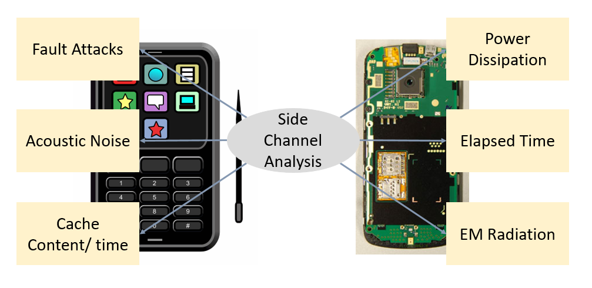
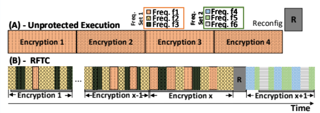
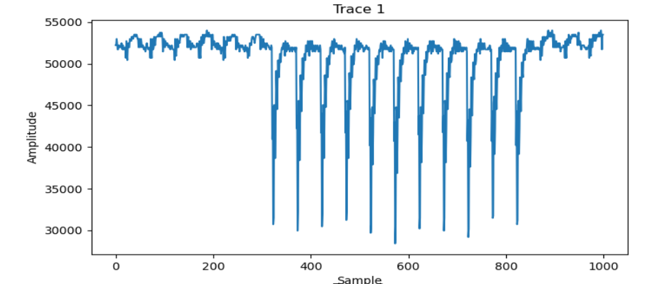
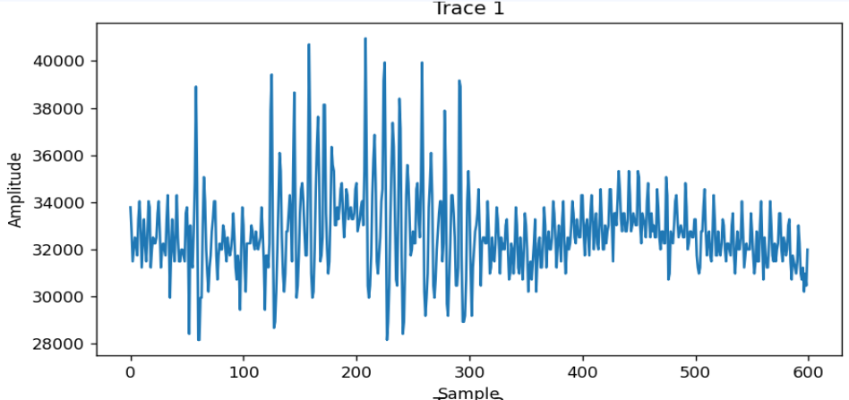

[comment]: # "This is the standard layout for the project, but you can clean this and use your own template"

# Investigating Machine Learning-based Attacks on Random Frequency Tuning-based Countermeasures

#### Team

- E17038, Chandrasekara C.M.A, [e17038@eng.pdn.ac.lk](mailto:e17038@eng.pdn.ac.lk)
- E17101, Gunathilaka S.P.A.U, [e17101@eng.pdn.ac.lk](mailto:e17101@eng.pdn.ac.lk)
- E17292, Rilwan M M M , [e17292@eng.pdn.ac.lk](mailto:e17292@eng.pdn.ac.lk)

#### Supervisors

- Damayanthi Herath, [damayanthiherath@eng.pdn.ac.lk](mailto:damayanthiherath@eng.pdn.ac.lk)
- Manjula Sandirigama, [manjula.sandirigama@eng.pdn.ac.lk](mailto:manjula.sandirigama@eng.pdn.ac.lk)
- Darshana Jayasinghe, [darshana.jayasinghe@gmail.com](mailto:darshana.jayasinghe@gmail.com)

#### Table of content

1. [Abstract](#abstract)
2. [Related works](#related-works)
3. [Methodology](#methodology)
4. [Results and Analysis](#results-and-analysis)
5. [Conclusion](#conclusion)
6. [Publications](#publications)
7. [Links](#links)

---

<!-- 
DELETE THIS SAMPLE before publishing to GitHub Pages !!!
This is a sample image, to show how to add images to your page. To learn more options, please refer [this](https://projects.ce.pdn.ac.lk/docs/faq/how-to-add-an-image/)

 
-->

## Abstract
Side-channel attacks (SCAs) pose a significant threat to the security of cryptographic systems. These attacks exploit unintended information leakage through side channels such as power consumption, timing variations, or electromagnetic radiation. Rather than directly breaking the algorithm, SCAs aim to extract sensitive information like secret keys by analyzing the physical implementations of cryptographic devices.

In recent years, deep learning (DL) techniques, including Recurrent Neural Networks (RNNs), Long Short-Term Memory (LSTM), Generative Adversarial Networks (GANs), Reinforcement Learning (RL), Deep Neural Networks (DNNs), and Convolutional Neural Networks (CNNs), have gained considerable attention and success across various fields. Each algorithm has its strengths and applications, with DNNs and CNNs often capturing most cases due to their capabilities in handling complex patterns and extracting meaningful features from high-dimensional data. Convolutional Neural Networks, in particular, have played a significant role in related research and publications.

 

Deep Learning-based SCA attacks leverage neural networks to learn complex relationships between observed side-channel leakage and underlying secret keys, even without knowledge of the algorithm used. By training DL models on large datasets of side-channel measurements or traces, these attacks enhance the efficiency and accuracy of information extraction, even in the presence of countermeasures. Although training DL models requires substantial labeled data, recent research has addressed issues related to data availability and cost.

The field of Deep Learning-based SCA attacks is rapidly evolving, with numerous research papers exploring various aspects. These include the design and architecture of DL models, the impact of different network configurations on attack performance, and the effectiveness of DL-based attacks against different cryptographic devices and countermeasures.

We are mainly targetting counter measure Runtime Frequency Tuning Countermeasure (RFTC). It is a random execution time countermeasure based on frequency randomization. In RFTC, the clock frequencies are chosen randomly from 3,702 distinct clock frequencies (arranged in 1024 X 3 groups) which are chosen carefully and fixed during design time. These selections are dobe at runtime to mitigate the vulnerabilities of power analysis attacks in FPGAs. to mitigate power analysis attack vulnerabilities of FPGAs. RFTC uses dynamic reconfiguration of clock managers of FPGAs (such as Xilinx Mixed-Mode Clock Manager - MMCM) to generate the desired clock frequencies within FPGA to run cryptographic circuits. No other countermeasure has been proved secure against Dynamic Time Warping based CPA attacks (DTW-CPA), Principal Component Analysis based CPA attacks (PCA-CPA) and Fast Fourier Transform based CPA attacks (FFT-CPA) except for RFTC. But, RFTC was not tested against deep learning based SCAs.

## Related works
##### Template Attack
Template attacks involve a pre-computation phase where the attacker gathers side-channel traces, known plaintexts, and secret keys. This phase includes statistical analysis on these traces. However, as the number of side-channel features increases, the data space's dimensionality grows, leading to sparse data in high-dimensional spaces. This sparsity makes accurate statistical modeling and pattern capture challenging. Analyzing data becomes computationally expensive and time-consuming due to the exponential increase in dimensions. Two prominent approaches in recent years are template attacks and machine learning-based attacks. Template attacks excel when few Points of Interest (POI) in leakage traces carry most information. Conversely, machine learning-based attacks become more favorable as useless samples in leakage traces increase.

##### Machine Learning Based Attack
As mentioned in the template attack, the dimensionality issue is discussed as a ”curse of dimensionality” in publications. Dimension reduction techniques like PCA (Principal Component Analysis) and LDA (Linear Discriminant Analysis) can be used to overcome this problems. Research primarily revolves around machine learning attacks on PRESENT and AES in channel analysis. Classical machine learning techniques like Random Forest, Support Vector Machines, Naive Bayes, and multilayer perceptrons have been extensively explored and valued for their effectiveness across domains. For instance, Random Forest uses decision tree ensembles for predictions, while Naive Bayes, based on Bayes' theorem, is commonly used for text classification and spam filtering. The emerging field of deep learning sees a focus on Deep Neural Networks (DNNs) and Convolutional Neural Networks (CNNs) in most papers.

##### Random Frequency Tuning-based Countermeasures - RFTC
RFTC utilizes the flexibility of clock managers in Field-Programmable Gate Arrays (FPGAs) like the Xilinx Mixed-Mode Clock Manager (MMCM). By dynamically adjusting the operating frequency, RFTC implements the Advanced Encryption Standard (AES) block cipher algorithm using randomly chosen clock frequencies from a vast set. This method aims to reduce vulnerabilities to power analysis attacks.

The effectiveness of this clock randomization approach is evaluated through Correlation Power Analysis (CPA) attacks conducted on collected power traces. Various preprocessing techniques such as Dynamic Time Warping (DTW), Principal Component Analysis (PCA), and Fast Fourier Transform (FFT) are employed on the power traces to assess the removal of patterns resulting from random execution

## Methodology

The experiments were conducted using an FPGA prototype board equipped with an isolated power line and signal amplifier.Meticulous preservation of power traces, which detailed voltage fluctuations during cryptographic operations, was essential. These traces were stored in a binary file format for detailed examination and confirmation purposes.We possessed binary files containing essential data, including plaintexts, ciphertexts, keys, and power traces.we aimed to segregate these files into a strategic split into profiling and training datasets. Typically, we adhere to conventional splits such as 70%-30% or 80%-20% for this purpose.

To ensure smooth handling of datasets and power traces, we employed the SASEBO process, a trusted method for their separation. Our research required a deep learning framework tailored for side-channel analysis, specifically targeting AES encryptions. The AISY framework served as our solution, offering a user-centric web application with an intuitive interface for visualizing analyses and presenting results effectively. Aligning with AISY's requirements, we converted our datasets into the .h5 format, utilizing a dedicated code snippet provided by the framework's creators for this purpose.

When examining unprotected power traces, we extensively plotted and analyzed them. Identifying all 10 rounds was relatively simple as they aligned with a single frequency usage.

To enhance our results, we employed both existing and customized models (MLP and CNN models), ensuring consistency in our data partitions. Our efforts aimed at achieving higher success rates led us to conduct attacks, leveraging leakage models like Hamming Distance, Hamming Weight, Identity, and bits. Throughout our experiments, we adjusted parameters such as epochs, batch sizes, optimizers, and activation functions in pursuit of increased success rates

In our data preprocessing phase, we integrated the Fast Fourier Transform (FFT) as a denoising technique for the power trace. Our focus centered on exploring various threshold frequency values—0.1, 0.2, and 0.3—to ascertain the most effective denoising impact.

When addressing RFTC-protected power traces, we consistently encountered a zero success rate. The visualization of power trace data posed challenges in distinguishing between rounds.

Consequently, we adjusted our approach to isolate similar traces, utilizing a correlation coefficient. By setting a threshold of correlation coefficient higher than 0.75, we filtered and retained only those traces exhibiting significant similarity. Additionally, we integrated FFT as part of our preprocessing steps to further refine the data.

## Results and Analysis

### Attacking Unprotected AES

+ We used some previously collected 100,000 power traces to train the model and attack AES without any countermeasures.
+ Attacks using basic MLP and CNN models were carried out using those power traces to find the model and parameters that fit best for attacking the AES circuit that was used to collect the traces.
+ We used 60000 power traces for training the models and 40000 power traces for attacking.

#### Using MLP
+ We found that the leakage model for carrying out successful attacks using the basic MLP model built in AISY, was the identity leakage model.
+ For the attacks carried out on the Sbox state of round 1 of AES in the encryption direction and got higher success rates for a majority of key bytes.
+ We achieved following significant results;
    + Byte 0 - 60%
    + Byte 1 - 100%
    + Byte 3 - 100%
    + Byte 4 - 100%
    + Byte 5 - 100%
    + Byte 10 - 100%
    + Byte 11 - 100%
    + Byte 13 - 81%
    + Byte 14 - 100%
    + Byte 15 - 100%

#### Using CNN
+ As with MLP, we found that the identity leakage model fits best for attacking the target system using CNN also.
+ We attacked the Sbox state of round 1 of AES in the encryption direction. We achieved better results compared to the previously used basic MLP model.
+ We achieved following significant results;
    + Byte 0 - 100%
    + Byte 1 - 100%
    + Byte 3 - 100%
    + Byte 4 - 100%
    + Byte 5 - 100%
    + Byte 6 - 100%
    + Byte 7 - 99%
    + Byte 11 - 100%
    + Byte 13 - 100%
    + Byte 14 - 100%
    + Byte 15 - 100%
+ Only 25000 traces were required for revealing the 15th key byte. For other key bytes, 30000 to 40000 traces were required.

### Attacking RFTC-Protected AES

For attacking RFTC-protected AES, we used 1000000 traces: 600000 for training and 400000 for attacking. Using the same models and the same leakage model, batch size, and number of epochs, we attacked the Sbox state of round 1 of RFTC-protected AES, but those attacks weren’t successful. Even using all the 400000 power traces, we weren’t able to successfully attack any key byte of RFTC-protected AES.

Next, we filtered a set of similar traces from the power traces we obtained from RFTC-protected AES using correlation coefficients. But, in the filtered dataset, there were only 34008 power traces in the training set and 22672 power traces in the attack set. We carried out attacks using these data, but those attacks were unsuccessful. We did not try filtering the power traces obtained from unprotected AES because all the traces are very similar to each other.

Then we used the Fast Fourier transform on protected traces and used the transformed traces to attack unprotected AES. This was done expecting to compare the results with RFTC-protected AES traces when FFT is applied to them. Figure number and Figure number show a transformed unprotected AES trace and a transformed RFTC-protected AES trace, respectively. But those attacks also were unsuccessful.

Attacks carried out on RFTC-protected AES implementation were unsuccessful due to several reasons. The main reason was the randomness of the frequencies of the power traces. Because of this, identifying the rounds of AES in the attack traces was really hard. Here, we assumed that the first 100 samples included the first two rounds. Attacking using filtered similar traces was unsuccessful because of the insufficient number of traces in the dataset.

## Conclusion

## Publications
[//]: # "Note: Uncomment each once you uploaded the files to the repository"

<!-- 1. [Semester 7 report](./) -->
<!-- 2. [Semester 7 slides](./) -->
<!-- 3. [Semester 8 report](./) -->
<!-- 4. [Semester 8 slides](./) -->
<!-- 5. Author 1, Author 2 and Author 3 "Research paper title" (2021). [PDF](./). -->

....pending

## Links

[//]: # ( NOTE: EDIT THIS LINKS WITH YOUR REPO DETAILS )

- [Project Repository](https://github.com/cepdnaclk/e17-4yp-Deep-Learning-for-Side-Channel-Attacks)
- [Project Page](https://cepdnaclk.github.io/e17-4yp-Deep-Learning-for-Side-Channel-Attacks/)
- [Department of Computer Engineering](http://www.ce.pdn.ac.lk/)
- [University of Peradeniya](https://eng.pdn.ac.lk/)

[//]: # "Please refer this to learn more about Markdown syntax"
[//]: # "https://github.com/adam-p/markdown-here/wiki/Markdown-Cheatsheet"
